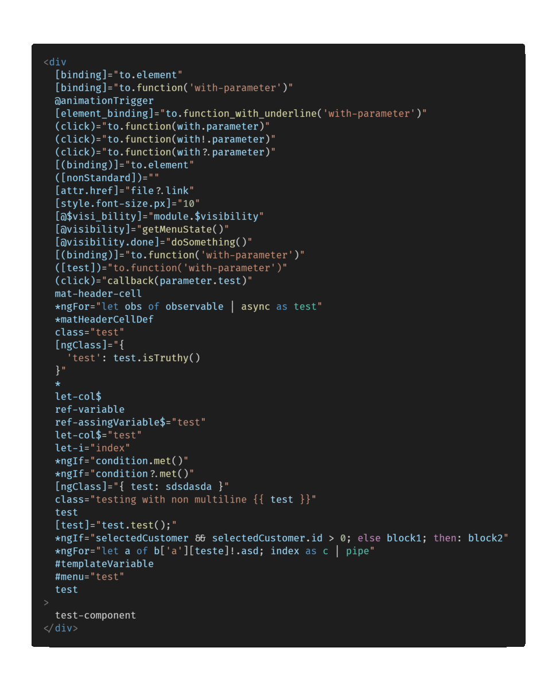
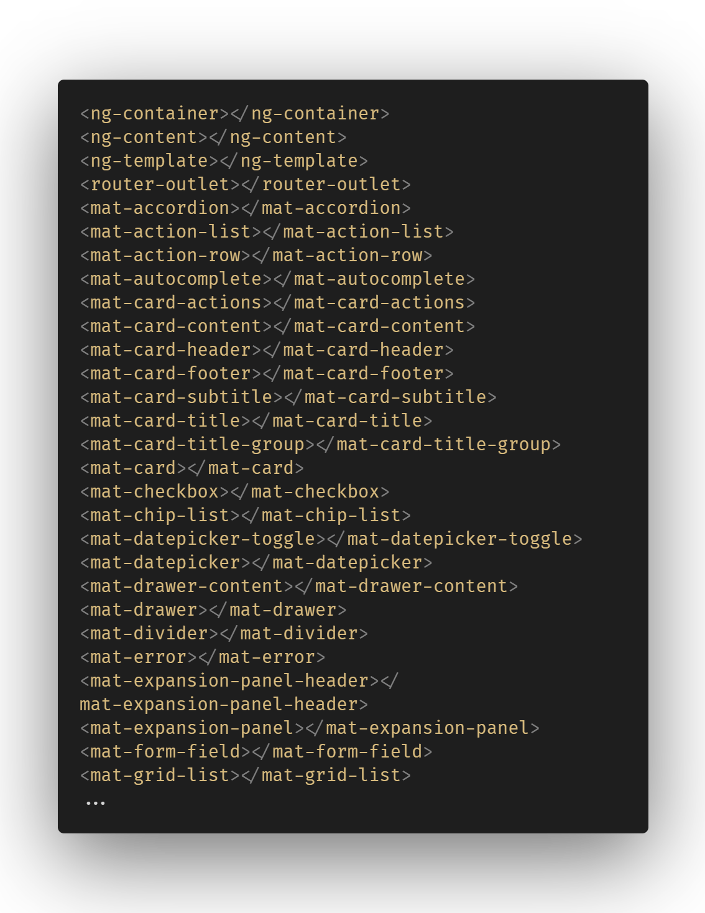
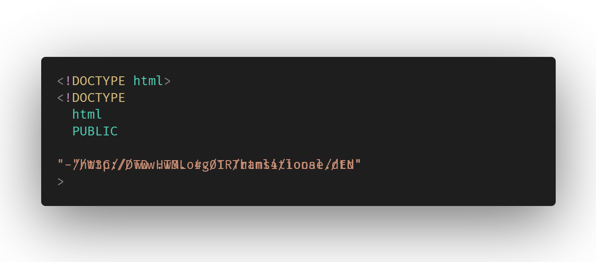
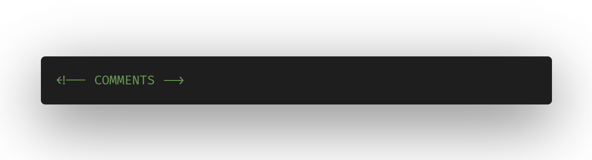
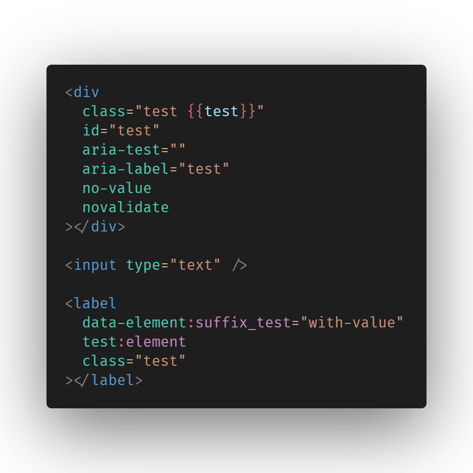
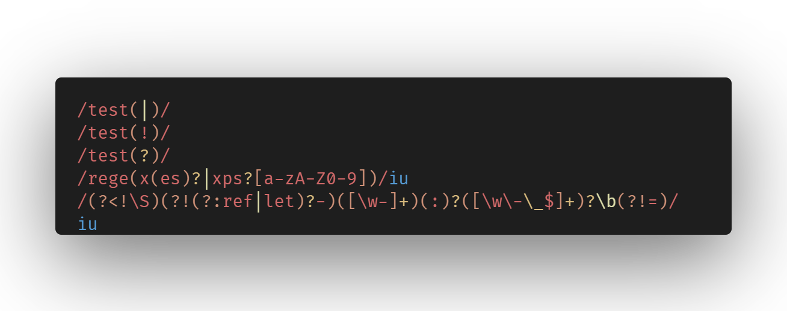
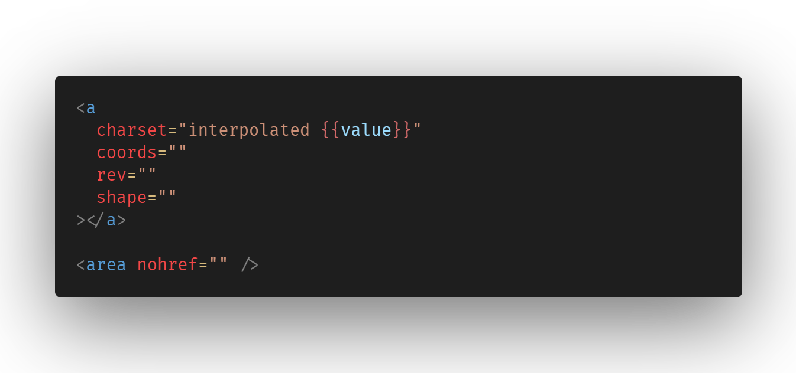
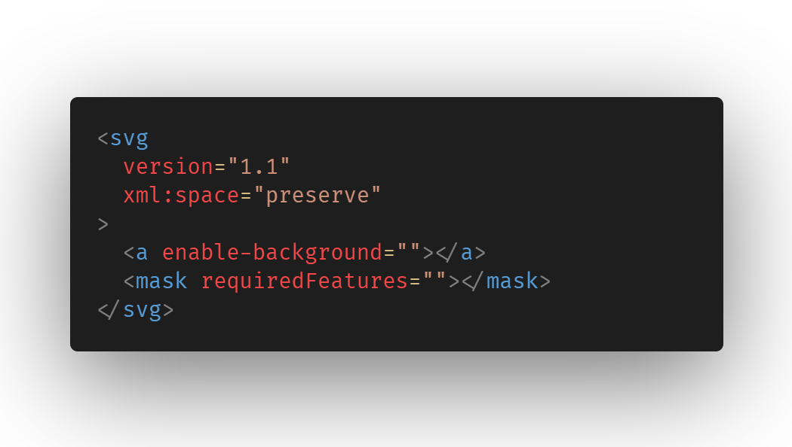

# vscode-angular-html

    

> Note: No theme will have the highlighting displayed in these images. For that effect, run the `vscode-angular-html: Set custom color customizations` command from the command pallete and you're good to go.

## Angular HTML Template Syntax Highlighting

This plugin adds syntax highlighting for angular HTML template files in VS Code. It supports the angular syntax itself, HTML DOM events, SVG, XML (with DTD and namespaces support), emphasizes deprecated and obsolete tags and attributes usage according to the current status of HTML. Also supports custom colors for extra-matched scopes. See [settings](docs/SETTINGS.md)

# Summary

- [vscode-angular-html](#vscode-angular-html)
  - [Angular HTML Template Syntax Highlighting](#angular-html-template-syntax-highlighting)
- [Summary](#summary)
- [General](#general)
  - [Element differentiation (HTML/SVG/Custom/Angular)](#element-differentiation-htmlsvgcustomangular)
  - [Customizations](#customizations)
- [Angular](#angular)
  - [Directives](#directives)
  - [Interpolations](#interpolations)
  - [Control Flow](#control-flow)
  - [Structural tags](#structural-tags)
- [HTML](#html)
  - [Doctype](#doctype)
  - [Comments](#comments)
  - [Entities](#entities)
  - [PrimeNG](#primeng)
  - [NG Bootstrap](#ng-bootstrap)
  - [Kendo UI](#kendo-ui)
  - [Custom components](#custom-components)
  - [DOM events](#dom-events)
  - [Generic attributes](#generic-attributes)
  - [Style inline](#style-inline)
  - [Regex](#regex)
  - [Deprecated attributes](#deprecated-attributes)
  - [Deprecated tags](#deprecated-tags)
  - [ARIA-prefixed attributes](#aria-prefixed-attributes)
  - [Data attributes](#data-attributes)
- [SVG](#svg)
  - [Non-string attributes](#non-string-attributes)
  - [Deprecated tags](#deprecated-tags-1)
  - [Deprecated attributes](#deprecated-attributes-1)
- [XML](#xml)
  - [DTD, elements and attributes namespace](#dtd-elements-and-attributes-namespace)
  - [Stylesheet](#stylesheet)
- [Style tags (CSS/SASS/PostCSS/SCSS/Stylus)](#style-tags-csssasspostcssscssstylus)
  - [CSS](#css)
  - [SCSS](#scss)
  - [LESS](#less)
  - [SASS](#sass)
  - [Stylus](#stylus)
  - [PostCSS](#postcss)
  - [CSS Fallback](#css-fallback)
- [Script tag (Javascript/Typescript/Coffeescript/Dart)](#script-tag-javascripttypescriptcoffeescriptdart)
  - [Javascript](#javascript)
  - [Typescript](#typescript)
  - [Coffeescript](#coffeescript)
  - [Dart](#dart)
  - [Javascript fallback](#javascript-fallback)
- [Link tags](#link-tags)
- [Theming](#theming)
- [Translate](#translate)
- [Changelog](#changelog)

# General

## Element differentiation (HTML/SVG/Custom/Angular)

> The highlighting displayed in this specific section is not part of the custom color customization, and can be achieved by changing this [extension' settings](docs/SETTINGS.md).

> See [Angular-specific list](docs/ANGULAR-SPECIFIC-TAGS.md)

> See [HTML-specific list](docs/HTML-SPECIFIC-TAGS.md)

> See [SVG-specific list](docs/SVG-SPECIFIC-TAGS.md)

> See [PrimeNG-specific list](docs/PRIMENG.md)

## Customizations

> There are a ton of customizations available, and everything can be changed in this [extension' settings](docs/SETTINGS.md).

# Angular

## Directives

## Interpolations

## Control Flow

## Structural tags

> See the [complete list](docs/ANGULAR-SPECIFIC-TAGS.md)

# HTML

## Doctype

## Comments

## Entities

> See the [complete list](docs/HTML-ENTITIES.md)

## PrimeNG

> See the [complete list](docs/PRIMENG.md)

## NG Bootstrap

> See the [complete list](docs/NG-BOOTSTRAP.md)

## Kendo UI

> See the [complete list](docs/KENDO-UI.md)

## Custom components

> See [color-customization](docs/SETTINGS.MD)

## DOM events

> See the [complete list](docs/DOM-EVENTS.md)

## Generic attributes

## Style inline

And with [colorize support](https://marketplace.visualstudio.com/items?itemName=kamikillerto.vscode-colorize):

> See [colorize settings](docs/COLORIZE-SETTINGS.md)

## Regex

## Deprecated attributes

> See the [complete list](docs/DEPRECATED-HTML-ATTRIBUTES.md)

## Deprecated tags

> See the [complete list](docs/DEPRECATED-HTML-TAGS.md)

## ARIA-prefixed attributes

> See the [complete list](docs/ARIA-ATTRIBUTES.md)

## Data attributes

# SVG

## Non-string attributes

> See [SVG's non string attributes](docs/SVG-NONSTRING-ATTRIBUTES.md)

> Elements like stroke can benefit from the [colorize settings](docs/COLORIZE-SETTINGS.md) as the [style inline](#style-inline) section.

## Deprecated tags

> See the [complete list](docs/DEPRECATED-SVG-TAGS.md)

## Deprecated attributes

> See the [complete list](docs/DEPRECATED-SVG-ATTRIBUTES.md)

# XML

## DTD, elements and attributes namespace

## Stylesheet

# Style tags (CSS/SASS/PostCSS/SCSS/Stylus)

> See [scripts and style MIME-types](docs/MIME-TYPES.md)

> See [linting tips](docs/LINTING.md)

> Every MIME-type shown in this section also will be highlighted in `<link>` elements

> Every style tag in this section can also benefit from the [colorize settings](docs/COLORIZE-SETTINGS.md) as the [style inline](#style-inline) section

## CSS

## SCSS

> The displayed highlighting is achieved via [vscode-angular-scss](https://marketplace.visualstudio.com/items?itemName=ghaschel.vscode-angular-scss) and it fallbacks to the default one if not installed.

## LESS

## SASS

## Stylus

## PostCSS

> The displayed highlighting is achieved via [language-postcss](https://marketplace.visualstudio.com/items?itemName=cpylua.language-postcss) and it may be replaced with another extension as soon as [this merge](https://github.com/csstools/postcss-language/pull/13) is released in a new version of the plugin

## CSS Fallback

# Script tag (Javascript/Typescript/Coffeescript/Dart)

> See [scripts and style mime-types](docs/MIME-TYPES.md)

## Javascript

## Typescript

## Coffeescript

## Dart

## Javascript fallback

# Link tags

# Theming

> If you want to create a theme and support this extension, please checkout the [theming docs](docs/THEMING.md)

# Translate

> If you want to help translating this extension, please checkout the [localization docs](docs/LOCALIZATION.md)

# Changelog

> See the [changelog](CHANGELOG.md)
