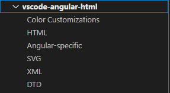
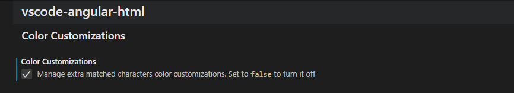
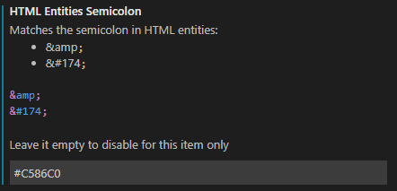

# Settings

## Categories

The settings are separated into language-specific topics

## Enable/Disable

You can enable or disable the extra-matched color customizations. You can manually make changes to your liking, or you can choose the Legacy colors via the command `Enable Legacy Colors`

## Changing colors

This extension' settings are really self-explanatory and it provides real time preview of the changes you are making. But here is an example of how it looks like.

