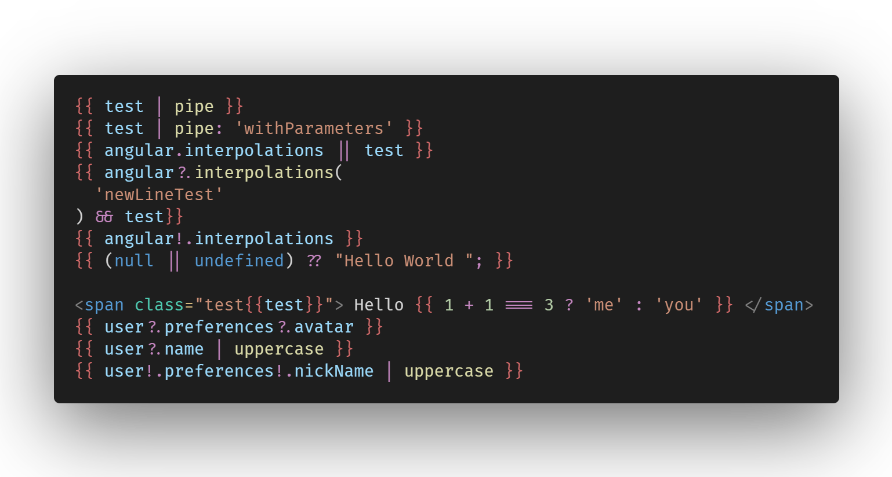
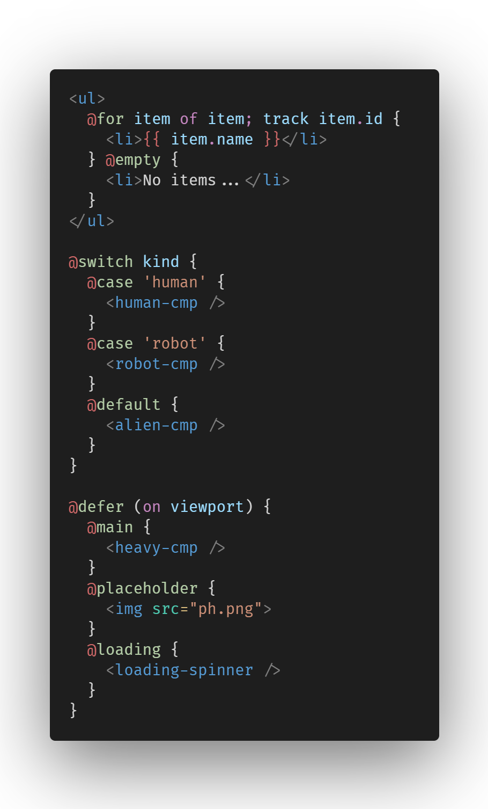
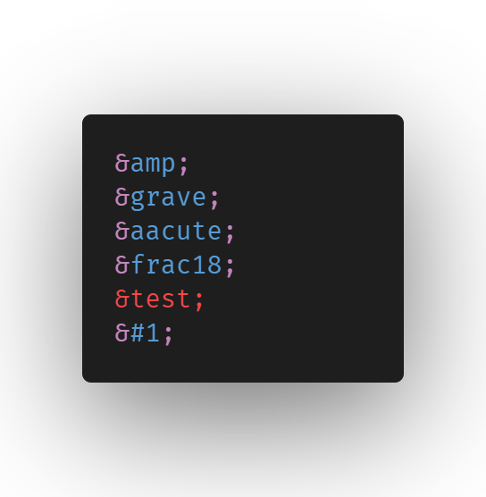
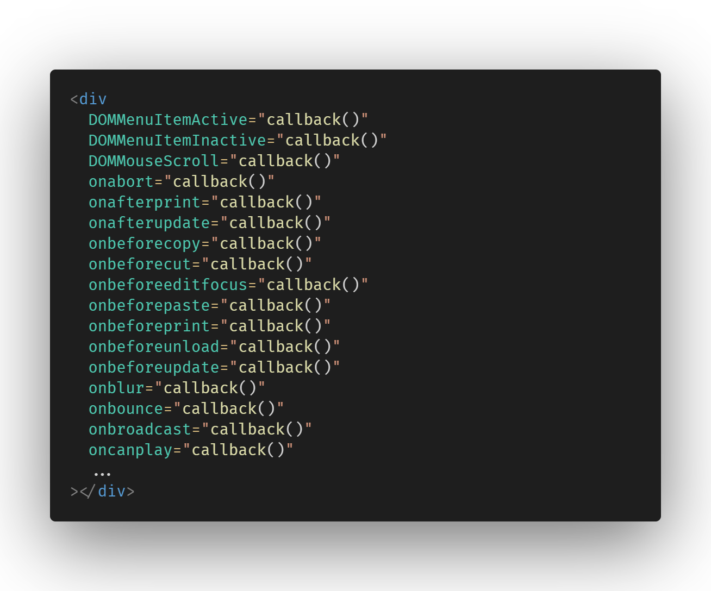
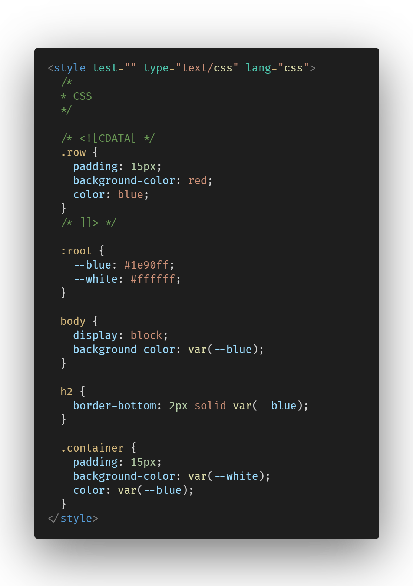
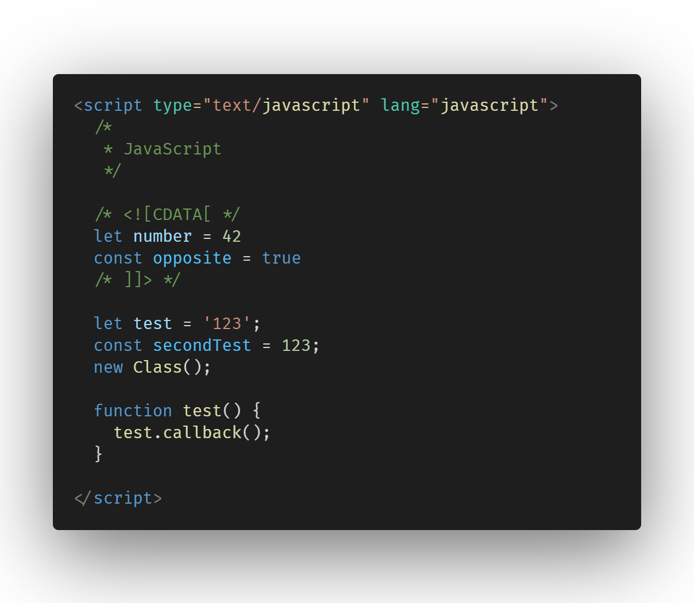

# Custom Scope Names

> This file aims to be used as a way to point out the extra-matched scopes for themes to be able to support them.

> This extension also has support for specific themes when enabling legacy colors customization, and as a fallback, it **_tries_** to generate a color-pallete based on the current theme. For the list of supported themes, please refer to [supported themes](SUPPORTED-THEMES.md).

## Summary

- [Custom Scope Names](#custom-scope-names)
  - [Summary](#summary)
- [General](#general)
  - [Element differentiation (HTML/SVG/Custom/Angular)](#element-differentiation-htmlsvgcustomangular)
- [Angular](#angular)
  - [Directives](#directives)
  - [Interpolations](#interpolations)
  - [Control Flow](#control-flow)
- [PrimeNG](#primeng)
- [HTML](#html)
  - [Doctype](#doctype)
  - [Entities](#entities)
  - [DOM events](#dom-events)
  - [Generic attributes](#generic-attributes)
  - [ARIA attributes](#aria-attributes)
  - [Data attributes](#data-attributes)
- [SVG](#svg)
  - [Non-string attributes](#non-string-attributes)
- [XML](#xml)
  - [DTD, elements and attributes namespace](#dtd-elements-and-attributes-namespace)
    - [DTD](#dtd)
    - [Element Namespace](#element-namespace)
    - [Attribute Namespace](#attribute-namespace)
  - [Stylesheet](#stylesheet)
- [Style tags](#style-tags)
- [Script tags](#script-tags)
- [Link tags](#link-tags)

# General

## Element differentiation (HTML/SVG/Custom/Angular)

- custom-component - `html-template.tag.custom`
- div - `html-template.tag.html`
- mat-accordion - `entity.name.tag.html.ng`
- svg - `html-template.tag.svg`

# Angular

## Directives

- General
  - `=` - punctuation.separator.key-value.html-template.ng
- `[binding]`
  - `[` - punctuation.definition.ng-binding-name.begin.html
  - `binding` - html-template.ng.attributes.input-binding.first-level
  - `]` - punctuation.definition.ng-binding-name.end.html
- `@animationTrigger`
  - `@` - html-template.ng.attributes.animationtrigger.prefix
  - `animationTrigger` - html-template.ng.attributes.animationtrigger.variable
- `(click)`
  - `(` - punctuation.definition.ng-binding-name.begin.html
  - `click` - html-template.ng.attributes.event-handler
  - `)` - punctuation.definition.ng-binding-name.end.html
- `[(binding)]`
  - `[(` - punctuation.definition.ng-binding-name.begin.html
  - `binding` - html-template.ng.attributes.input-binding.first-level
  - `)]` - punctuation.definition.ng-binding-name.end.html
- `[(binding)]`
  - `[(` - punctuation.definition.ng-binding-name.begin.html
  - `binding` - html-template.ng.attributes.input-binding.first-level
  - `)]` - punctuation.definition.ng-binding-name.end.html
- `[style.font-size.px]`
  - `[` - punctuation.definition.ng-binding-name.begin.html
  - `style` - html-template.ng.attributes.input-binding.first-level
  - `font-size` - html-template.ng.attributes.input-binding.second-level
  - `px` - html-template.ng.attributes.input-binding.third-level
  - `]` - punctuation.definition.ng-binding-name.end.html
- `[@visibility]`
  - `[` - punctuation.definition.ng-binding-name.begin.html
  - `@` - html-template.ng.attributes.input-binding.animationTrigger.prefix
  - `visibility` - html-template.ng.attributes.input-binding.first-level
  - `]` - punctuation.definition.ng-binding-name.end.html
- `*ngFor`
  - `*` - html-template.ng.attributes.prefix.sugar
  - `ngFor` - html-template.ng.attributes.suffix.sugar
- `ref-assignVariable$`
  - `ref-` - html-template.ng.attributes.prefix.ref
  - `assignVariable` - html-template.ng.attributes.suffix.name
  - `$` - html-template.ng.attributes.suffix.rxjs
- `let-col$`
  - `let-` - html-template.ng.attributes.prefix.let
  - `col` - html-template.ng.attributes.suffix.name
  - `$` - html-template.ng.attributes.suffix.rxjs
- `#templateVariable`
  - `#` - html-template.ng.attributes.template.prefix
  - `templateVariable` - html-template.ng.attributes.template.variable`

## Interpolations

- `{{` - html-template.ng.interpolation.begin
- `|`, `||`, `&&` - html-template.ng.expression.operator.logical
- `.`, `?.`, `!.` - html-template.ng.expression.operator.navigator
- `+`, `-`, `/`, `*`, `%` - html-template.ng.expression.operator.arithmetic
- `==`, `===` - html-template.ng.expression.operator.comparison
- `?`, `:` - html-template.ng.expression.operator.navigator
- `??`, `&` - html-template.ng.expression.operator.bitwise
- `}}` - html-template.ng.interpolation.end

## Control Flow

- `@` - html-template.ng.control-flow.prefix
- `for`, `switch`, `if`, `[...]` - html-template.ng.control-flow.keyword

# PrimeNG

- `p-calendar` - entity.name.tag.html.primeng

# HTML

## Doctype

- `!` - html-template.ng.exclamation.doctype
- `DOCTYPE` - html-template.ng.doctype
- `html` - html-template.ng.attribute.doctype

## Entities

- `&` - html-template.ng.entities.ampersand
- `;` - html-template.ng.entities.semicolon

## DOM events

- `onabort` - html-template.ng.attributes.events

## Generic attributes

- `class` - html-template.ng.attributes.generic

## ARIA attributes

- `aria-` - html-template.ng.aria-attribute.prefix
- `sort` - html-template.ng.aria-attribute.suffix

## Data attributes

- `data-` - html-template.ng.data-attribute.prefix
- `test` - html-template.ng.data-attribute.suffix

# SVG

## Non-string attributes

- `M`202.35,163.64`l`-4.38-13.1`h`-2.13`v`-3.85`h`9.1`v`3.85`h`-1.82`l`2.05`z`" - `html-template.ng.svg.path.commands`

# XML

## DTD, elements and attributes namespace

### DTD

- `<!ELEMENT DAY (DATE,(HOLIDAY|PROGRAMSLOT+)+)>`
  - `!` - html-template.ng.exclamation.dtd
  - `ELEMENT` - html-template.ng.dtd
  - `DAY` - html-template.ng.attribute.doctype
  - `HOLIDAY` - html-template.ng.qualifier.dtd
  - `|`, `+`, `?`, `*` - html-template.ng.occurrence.dtd
- `<!ELEMENT BANNER (#PCDATA)>`
  - `#PCDATA` - constant.language.dtd

### Element Namespace

- `<li:book>`
  - `:` - html-template.ng.tag.colon
  - `book` - html-template.ng.tag.suffix

### Attribute Namespace

- `xmlns:list="listurl"`
  - `:` - html-template.ng.attributes.colon
  - `list` - html-template.ng.attributes.suffix

## Stylesheet

- ``type="text/xls"`
  - `xls` - html-template.ng.xmlStylesheet.language.identifier

# Style tags

- `type="text/css"`
  - `css` - html-template.ng.style.language.identifier
- `lang="css"`
  - `css` - html-template.ng.style.language.identifier

# Script tags

- `type="text/javascript"`
  - `javascript` - html-template.ng.script.language.identifier
- `lang="javascript"`
  - `javascript` - html-template.ng.script.language.identifier

# Link tags

- `type="image/x-icon"`
  - `x-icon` - html-template.ng.link.myme-type
